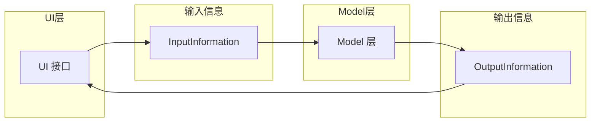
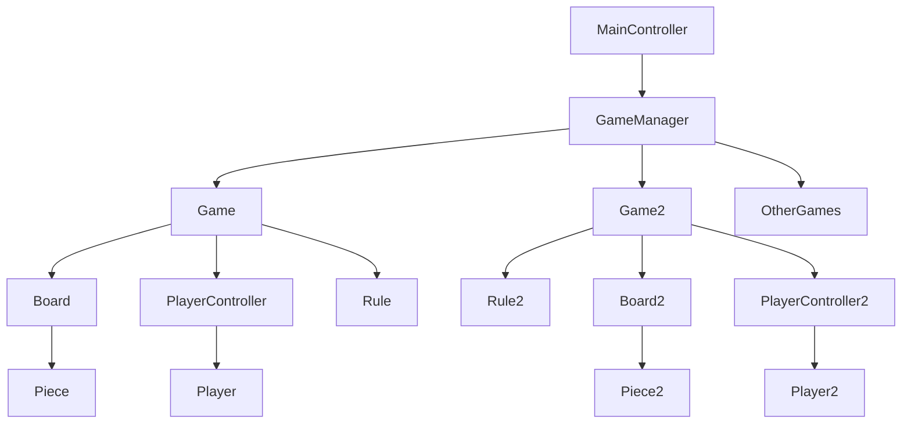

# OOP PJ REPORT

## 环境
---
实验环境为 macOS 15.5，使用的IDE为VSCODE，JDK 版本为 OpenJDK 23.0.1。
```
(base) zhaojingyan@MacBook reversi % java --version
openjdk 23.0.1 2024-10-15
OpenJDK Runtime Environment (build 23.0.1+11-39)
OpenJDK 64-Bit Server VM (build 23.0.1+11-39, mixed mode, sharing)
```
## 编译运行

---
### 编译
在根目录下运行

```bash
> ./build.sh
```

会编译得到一个fat jar包，命名为 `reversi.jar`，在 `./target` 目录下。

### 运行
PJ实现了console和gui两种版本的游戏，编译后均可以启动，只需要传入不同的命令行参数即可。
#### 命令行版本
在根目录下运行两个命令其中之一

```bash
> ./con.sh
```

```bash
> java -jar {path}/reversi.jar
```

即可启动命令行版本游戏
#### 图形化版本
在根目录下运行两个命令其中之一
```bash
> ./gui.sh
```

```bash
> java -jar {path}/reversi.jar -gui
```

即可启动图形化版本游戏

## 代码结构
model层的代码没有发生大的重写，只是微调了包结构和部分函数的可见性以进行更好的封装。

我们先来分析最顶层的，最抽象的结构

如上图所示，model 层接收来自 UI 接口的 `InputInformation`，经过处理后生成 `OutputInformation`，再返回给 UI 层，实现交互。

### model层
model层的包结构如下
```
model
├── entities/ #游戏实体
├── enums/    #状态枚举
├── input/    #输入信息
├── output/   #输出信息
├── rule/     #游戏规则
└── service/  #业务逻辑
```

#### entities
实体类主要是游戏中相对稳定的的棋盘，棋子，玩家，分别对应 `Board` ，`Piece`和`Player` 类。棋盘类中包含了棋盘的状态，棋子的颜色等信息。

#### enums
枚举类提供了清晰的状态定义。

#### rule
rule通过一个接口定义了rule， board + rule的组合实现了游戏，体现了组合优于继承的设计原则。rule接口定义了游戏的规则，board类实现了棋盘的状态。

#### service
service是最重要的业务逻辑。
有如下的控制结构


如上图所示，MainController是主控制器，负责管理游戏的主循环。GameManager负责管理游戏的状态和规则。Game类是游戏对象，负责处理游戏的逻辑。PlayerController负责管理玩家轮换。

保存时,直接将这一刻的GameManager对象保存到文件中。读取时，直接读取文件中的GameManager对象。这样就可以实现游戏的保存和读取。他管理的所有类都实现了Serializable接口。

#### input
输入信息类主要是对输入信息的封装，提供了一个统一的接口来处理输入信息。它包含了输入信息的类型和内容等信息。通过将每种信息的处理方法放在实现类中，可以避免大量的if else和switch语句，使得业务逻辑代码更加清晰和易于维护。

#### output
输出信息类主要是对输出信息的封装。其中有一个类似文件夹结构的数据关系
一个outputinformation包含一个type来提示ui层如何刷新，还包含一个gameinfo，维护了当前棋局的信息，和一个globalinfo，维护了全局的gamelist等信息。所有gamemanager和game的getter都是protected的，只有outputinformation可以访问到它们。这样可以避免ui层直接访问model层的代码，保持了良好的封装性。

#### 总结
如上的model层不关系ui层的实现，ui层只需要实现UI接口即可。这样就可以实现model层和ui层的解耦。ui层不论是console还是gui都可以使用同样的model层代码。这样就可以实现代码的复用和扩展。

### ui层
ui层的包结构如下
```
ui
├── console/    #控制台UI
├── gui/        #图形化UI
├── interface/  #接口
└── util/       #工具类
```
#### console output
在之前的lab中，控制台的实现已经转变为使用screen的抽象来完成显示。通过buildScreen，output的逻辑变得非常简单。

#### gui output
图形化的实现使用了javafx，使用了javafx的scene和stage来实现窗口的显示。使用了类似console的抽象来实现显示。通过四块panel，分别组织各自的内容，并调整大小打印。

#### console input
console方法变化不大，将输入的字符串转化为一个inputinformation对象，传递给model层。通过一个while循环来实现输入的处理。使用了一个线程来处理输入，避免了阻塞。顺便为playback添加了gui的支持。

#### gui input
gui的输入使用了javafx的事件处理机制，每个按钮维护一个String信息，点击后将String传递给处理器，处理得到一条information对象，传递给model层。Bomb是提前放置一个@，继续等待字符串输入。

#### 总结
ui层通过合理的抽象，与model层解耦。ui层只需要实现UI接口即可。ui层不论是console还是gui都可以使用同样的model层代码。这样就可以实现代码的复用和扩展。

## 问题回答

### 1. 代码复用
model层和之前的lab几乎没有差异，只是有几处小的修改。console ui也可以运行，代码复用率高。

### 2. 2048游戏添加
2048游戏可以设计为4*4的board，一套自己的rule，自己的playercontroller，自己的game。但是，在gamemanager看来，他依旧是一个game。也可以提供game接口，让2048游戏实现game接口。这样就可以实现代码的高度复用。

至于inputInformation可以复用move，也可以新建direction类，提供一个方向的枚举类。这样就可以实现代码的复用。

总之，扩展2048不需要大面积重写，只需要以插件的模式加入即可。
